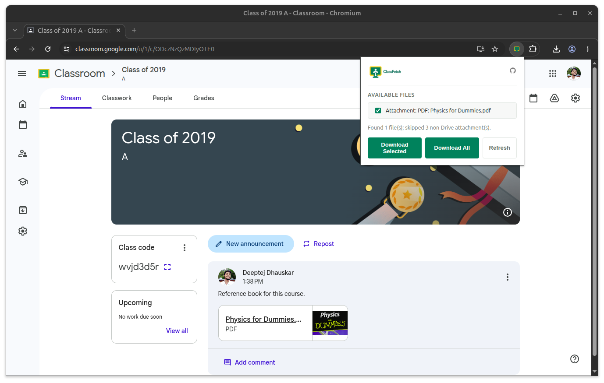

# ClassFetch
Bulk-download Google Drive attachments from Google Classroom posts in one click. No more opening and downloading each file one by one.

<!--  -->
 
## Why?
The goal was simple, to let users select multiple files and download them in one click instead of having to click on each file and downloading it one by one.

## How to install?
### From browser extension store

  
  
  

### From GitHub releases
1. Download the latest release from the [Releases page](https://github.com/deeptejd/classfetch/releases/latest). Get the `.zip` asset (not the source code!)
2. Unzip it somewhere permanent. Browsers load the extension from that folder, so don't delete or move it afterwards. The folder you load must be the one that directly contains `manifest.json`
3. Follow the steps for your browser:

<b>Chrome</b>

1. Open `chrome://extensions`
2. Turn on **Developer mode** (top-right toggle)
3. Click **Load unpacked** and select the unzipped folder

<b>Edge</b>

1. Open `edge://extensions`
2. Turn on **Developer mode** (left sidebar toggle)
3. Click **Load unpacked** and select the unzipped folder

<b>Brave</b>

1. Open `brave://extensions`
2. Turn on **Developer mode** (top-right toggle)
3. Click **Load unpacked** and select the unzipped folder

<b>Firefox</b>

1. Open `about:debugging#/runtime/this-firefox`
2. Click **Load Temporary Add-on**
3. Select the `manifest.json` file inside the unzipped folder

> Firefox removes temporary add-ons when the browser closes, so you'll need to load it again after each restart

**After installing or updating**
- Reload any open Google Classroom tab so the extension is picked up
- To update, download the new release, replace the old folder's contents, then click the **reload** icon on the extension's card (Chrome/Edge/Brave) or **Reload** (Firefox) on the same extensions page

## How to use?
1. Open a Google Classroom post or stream with Drive attachments, and scroll so the attachments load
2. Click the ClassFetch toolbar icon. Files that ClassFetch can download are listed with checkboxes
3. Check the files you want and click **Download Selected**, or click **Download All**

## How to contribute?
Pull requests are welcome. For major changes, please open an issue first to discuss what you'd like to change.
No build step: it's a plain MV3 extension (`manifest.json`, `scripts/`, `views/`, `styles/`, `icons/`). Edit files, reload the extension at the browser's extensions page, and refresh the Classroom tab.

- `scripts/content.js` — runs on `classroom.google.com`, scrapes Drive attachments
- `scripts/popup.js` + `views/popup.html` — toolbar popup UI
- `scripts/ext-api.js` — Firefox/Chrome API shim
- See `AGENTS.md` for repo conventions and gotchas.

## FAQ
**My files aren't showing up, even though they're in the stream.**
Scroll the stream so the attachment actually renders, then press Refresh in the popup. ClassFetch only downloads real Google Drive file attachments — Google Slides/Docs links are skipped and counted as "skipped."

**A downloaded file was flagged as `.htm` rather than the real file.**
The file's owner disabled downloads for it. Ask them to allow it.

## Releasing (maintainers)

1. Bump `version` in `manifest.json` (SemVer) and add a `CHANGELOG.md` entry. Commit both.
2. `git tag vX.Y.Z && git push origin main --tags`
3. Pushing the tag builds the zip and creates the GitHub release automatically. If it fails with "version does not match," fix the manifest and re-tag.

## License
[MIT](LICENSE)
